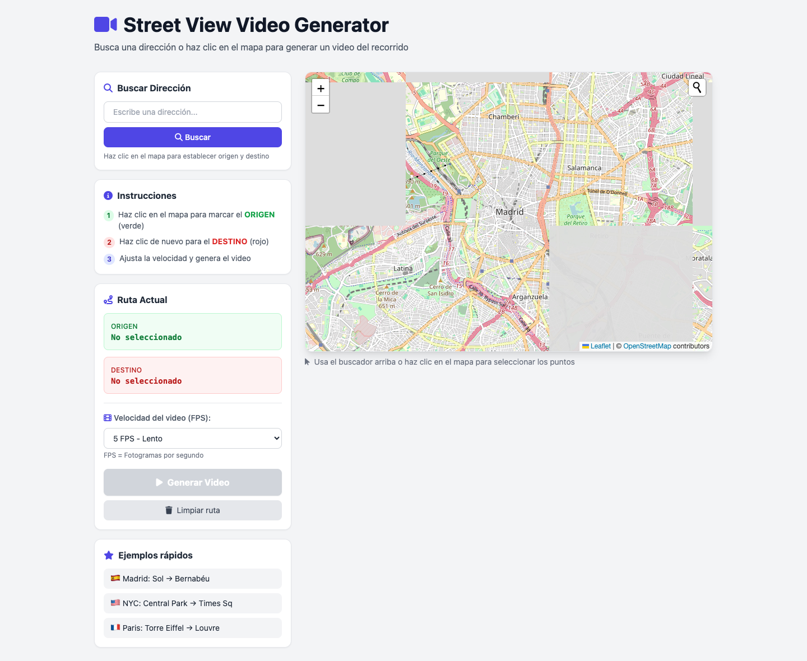
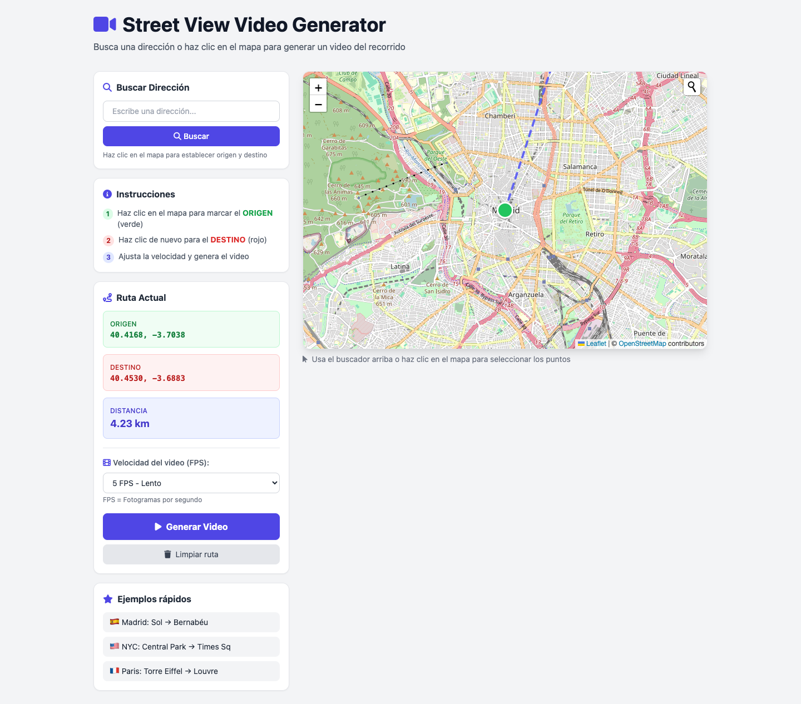
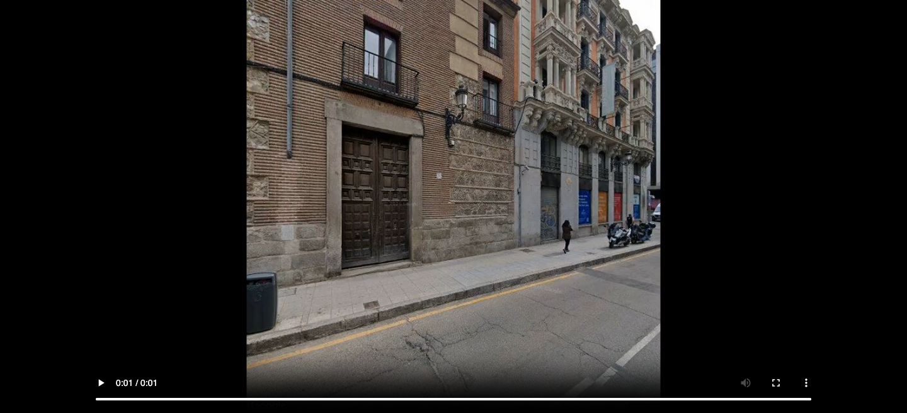

# Street View Video Generator 🎥🗺️

Transform any route on Google Maps into a stunning video journey using Street View imagery.

[](https://www.buymeacoffee.com/dustinbot)
[](https://opensource.org/licenses/MIT)
[](https://nodejs.org/)

## ✨ Features

- 🗺️ **Interactive Map** - Select start and end points visually
- 🔍 **Address Search** - Find locations by typing (powered by OpenStreetMap)
- 🎮 **Adjustable Speed** - Choose FPS (3, 5, 10, 15, 24) for different video speeds
- 🎯 **Smart Direction** - Camera always faces forward along the route
- 📱 **Responsive Design** - Works on desktop and mobile
- 🎬 **MP4 Output** - High-quality video with H.264 encoding
- ⚡ **Real-time Processing** - Videos generated in seconds

## 🚀 Live Demo

Try it now: [https://streetview-video.onrender.com](https://streetview-video.onrender.com) *(Deploy yours below!)*

## 📸 Screenshots

### Main Interface

*Clean, intuitive interface with map and controls*

### Route Selection

*Select origin (green) and destination (red) on the map*

### Address Search

*Search for any address worldwide*

### Video Generated

*Download your route video in MP4 format*

## 🛠️ Installation

### Prerequisites
- Node.js 18+ installed
- Google Cloud API Key with Directions API and Street View Static API enabled
- FFmpeg installed on your system

### Quick Start

```bash
# Clone the repository
git clone https://github.com/DustinGitBot/streetview-video-generator.git
cd streetview-video-generator

# Install dependencies
npm install

# Configure environment variables
cp .env.example .env
# Edit .env and add your Google API Key

# Start the server
npm start
```

The application will be available at `http://localhost:3000`

### Environment Variables

Create a `.env` file with:

```env
GOOGLE_API_KEY=your_google_api_key_here
PORT=3000
NODE_ENV=development
RATE_LIMIT_REQUESTS_PER_DAY=24000
MAX_ROUTE_DISTANCE_KM=50
FRAMES_PER_ROUTE=200
FRAME_WIDTH=640
FRAME_HEIGHT=640
VIDEO_FPS=10
```

## 🚀 Deployment

### Render (Free) - Recommended

[](https://render.com/deploy?repo=https://github.com/DustinGitBot/streetview-video-generator)

**One-Click Deploy:**
1. Click the button above
2. Add your `GOOGLE_API_KEY` in the environment variables
3. Deploy! 🎉

**Or manually:**
1. Fork this repository
2. Create a new Web Service on [Render](https://render.com)
3. Connect your GitHub repository
4. Add environment variables in Render Dashboard
5. Deploy!

### Railway (Free)

1. Click "New Project" on [Railway](https://railway.app)
2. Deploy from GitHub repo
3. Add environment variables
4. Your app is live!

### Vercel (Free)

[](https://vercel.com/new/clone?repository-url=https://github.com/DustinGitBot/streetview-video-generator)

## 💡 How It Works

1. **Route Calculation** - Uses Google Directions API to find the optimal route
2. **Frame Sampling** - Samples points along the route (up to 200 frames)
3. **Street View Capture** - Downloads Street View images at each point
4. **Heading Calculation** - Calculates camera direction to always face forward
5. **Video Encoding** - Uses FFmpeg to combine frames into MP4 video

## 🎨 Customization

### Adjust Video Speed

Choose FPS in the interface:
- **3 FPS** - Very slow, cinematic
- **5 FPS** - Slow and smooth (recommended)
- **10 FPS** - Normal speed
- **15 FPS** - Fast
- **24 FPS** - Very fast

### Change Default Location

Edit `public/index.html` and modify:
```javascript
const map = L.map('map').setView([40.4168, -3.7038], 13); // Madrid
```

## 🧠 AI Frame Interpolation (Future)

### Current Status
Currently evaluating AI solutions for smoother frame transitions:

| Solution | Cost | Quality | Speed |
|----------|------|---------|-------|
| **RIFE (Open Source)** | Free | High | Medium |
| **DAIN (Open Source)** | Free | Very High | Slow |
| **Topaz Video AI** | $299/license | Excellent | Fast |
| **AWS SageMaker** | ~$0.05/min | High | Fast |

### Recommendation
For a free solution, **[RIFE](https://github.com/hzwer/ECCV2022-RIFE)** provides excellent frame interpolation. Integration would:
- Double or triple frame rate
- Create ultra-smooth transitions
- Run locally (no API costs)

**Estimated cost for cloud AI:** $0.02-0.05 per video generated.

## 🤝 Contributing

Contributions welcome! Please read [CONTRIBUTING.md](CONTRIBUTING.md) first.

1. Fork the repository
2. Create your feature branch (`git checkout -b feature/amazing`)
3. Commit your changes (`git commit -m 'Add amazing feature'`)
4. Push to the branch (`git push origin feature/amazing`)
5. Open a Pull Request

## ☕ Support

If this project helped you, consider buying me a coffee:

[](https://www.buymeacoffee.com/dustinbot)

## 📜 License

MIT License - see [LICENSE](LICENSE) file

---

## 🇪🇸 Versión en Español

# Generador de Video Street View 🎥🗺️

Transforma cualquier ruta de Google Maps en un video espectacular usando imágenes de Street View.

### ✨ Características

- 🗺️ **Mapa Interactivo** - Selecciona inicio y fin visualmente
- 🔍 **Búsqueda de Direcciones** - Encuentra ubicaciones escribiendo
- 🎮 **Velocidad Ajustable** - Elige FPS (3, 5, 10, 15, 24)
- 🎯 **Dirección Inteligente** - La cámara siempre mira hacia adelante
- 📱 **Diseño Responsive** - Funciona en móvil y escritorio
- 🎬 **Salida MP4** - Video alta calidad con H.264

### 🚀 Demo en Vivo

Pruébalo: [https://streetview-video.onrender.com](https://streetview-video.onrender.com)

### 🛠️ Instalación Rápida

```bash
git clone https://github.com/DustinGitBot/streetview-video-generator.git
cd streetview-video-generator
npm install
cp .env.example .env
# Añade tu API Key de Google
npm start
```

### 🔑 Obtener API Key de Google

1. Ve a [Google Cloud Console](https://console.cloud.google.com/)
2. Crea un nuevo proyecto
3. Habilita **Directions API** y **Street View Static API**
4. Crea una API Key
5. Añádela al archivo `.env`

### 🚀 Despliegue Gratuito

**Render** (Recomendado):
1. Haz fork de este repositorio
2. Crea cuenta en [Render](https://render.com)
3. Conecta tu repo de GitHub
4. Añade variables de entorno
5. ¡Despliega!

**Vercel**:
[](https://vercel.com/new)

### 🧠 Interpolación de Fotogramas con IA

Para transiciones más suaves entre fotogramas:

| Solución | Coste | Calidad |
|----------|-------|---------|
| **RIFE** (Gratis) | Gratis | Alta |
| **DAIN** (Gratis) | Gratis | Muy Alta |
| **Topaz Video AI** | $299 | Excelente |

**Recomendación:** RIFE es gratuito y funciona localmente, duplicando la tasa de fotogramas para videos ultra-suaves.

### ☕ Apoya el Proyecto

Si te ha sido útil, invítame a un café:

[](https://www.buymeacoffee.com/dustinbot)

---

**Made with ❤️ by DustinBot**
